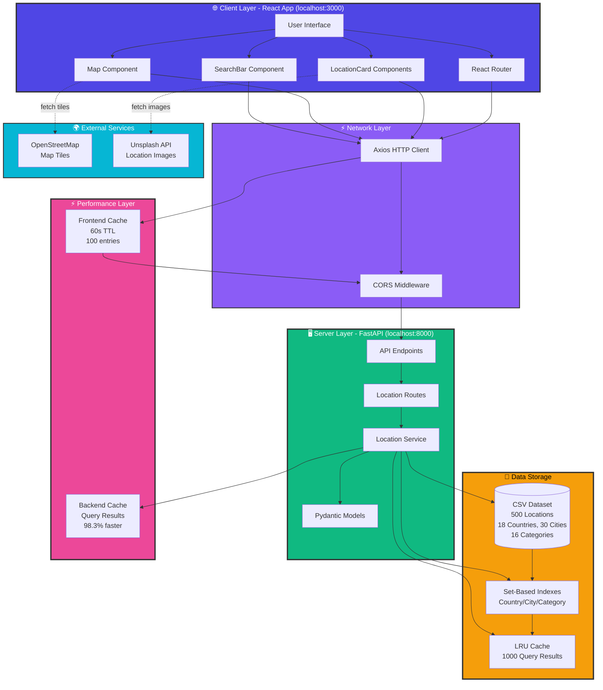

# BHRAMAN - System Architecture

```mermaid
graph TB
    subgraph CLIENT["🌐 Client Layer - React App (localhost:3000)"]
        UI[User Interface]
        SEARCH[SearchBar Component]
        MAP[Map Component]
        CARDS[LocationCard Components]
        ROUTER[React Router]
    end
    
    subgraph NETWORK["⚡ Network Layer"]
        AXIOS[Axios HTTP Client]
        CORS[CORS Middleware]
    end
    
    subgraph SERVER["🖥️ Server Layer - FastAPI (localhost:8000)"]
        API[API Endpoints]
        ROUTES[Location Routes]
        SERVICE[Location Service]
        MODELS[Pydantic Models]
    end
    
    subgraph STORAGE["💾 Data Storage"]
        CSV[(CSV Dataset<br/>500 Locations<br/>18 Countries, 30 Cities<br/>16 Categories)]
        INDEXES[Set-Based Indexes<br/>Country/City/Category]
        CACHE[LRU Cache<br/>1000 Query Results]
    end
    
    subgraph CACHING["⚡ Performance Layer"]
        BE_CACHE[Backend Cache<br/>Query Results<br/>98.3% faster]
        FE_CACHE[Frontend Cache<br/>60s TTL<br/>100 entries]
    end
    
    subgraph EXTERNAL["🌍 External Services"]
        OSM[OpenStreetMap<br/>Map Tiles]
        UNSPLASH[Unsplash API<br/>Location Images]
    end
    
    UI --> SEARCH
    UI --> MAP
    UI --> CARDS
    UI --> ROUTER
    
    SEARCH --> AXIOS
    MAP --> AXIOS
    CARDS --> AXIOS
    ROUTER --> AXIOS
    
    AXIOS --> CORS
    CORS --> API
    
    API --> ROUTES
    ROUTES --> SERVICE
    SERVICE --> MODELS
    SERVICE --> CSV
    SERVICE --> INDEXES
    SERVICE --> CACHE
    SERVICE --> BE_CACHE
    
    AXIOS --> FE_CACHE
    FE_CACHE --> CORS
    
    CSV --> INDEXES
    INDEXES --> CACHE
    
    MAP -.fetch tiles.-> OSM
    CARDS -.fetch images.-> UNSPLASH
    
    style CLIENT fill:#4f46e5,stroke:#333,stroke-width:3px,color:#fff
    style SERVER fill:#10b981,stroke:#333,stroke-width:3px,color:#fff
    style STORAGE fill:#f59e0b,stroke:#333,stroke-width:3px,color:#000
    style CACHING fill:#ec4899,stroke:#333,stroke-width:3px,color:#fff
    style EXTERNAL fill:#06b6d4,stroke:#333,stroke-width:2px,color:#fff
    style NETWORK fill:#8b5cf6,stroke:#333,stroke-width:2px,color:#fff
```
