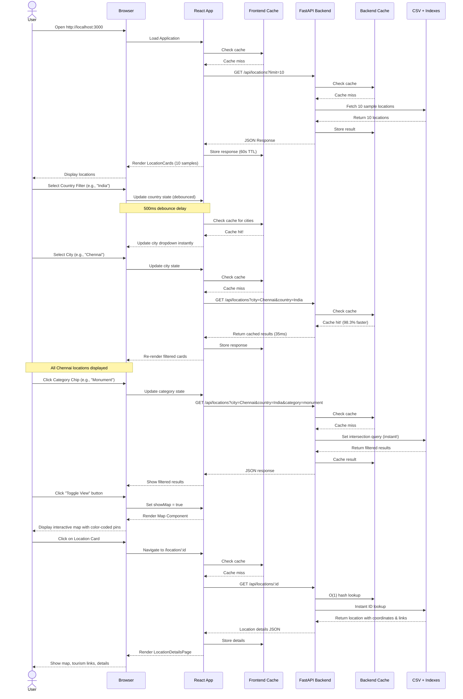

# Roamy - User Flow Sequence Diagram

```mermaid
sequenceDiagram
    actor User
    participant Browser
    participant React as React App
    participant Cache as Frontend Cache
    participant API as FastAPI Backend
    participant BECache as Backend Cache
    participant Storage as CSV + Indexes
    
    User->>Browser: Open http://localhost:3000
    Browser->>React: Load Application
    React->>Cache: Check cache
    Cache-->>React: Cache miss
    React->>API: GET /api/locations?limit=10
    API->>BECache: Check cache
    BECache-->>API: Cache miss
    API->>Storage: Fetch 10 sample locations
    Storage-->>API: Return 10 locations
    API->>BECache: Store result
    API-->>React: JSON Response
    React->>Cache: Store response (60s TTL)
    React-->>Browser: Render LocationCards (10 samples)
    Browser-->>User: Display locations
    
    User->>Browser: Select Country Filter (e.g., "India")
    Browser->>React: Update country state (debounced)
    Note over Browser,React: 500ms debounce delay
    React->>Cache: Check cache for cities
    Cache-->>React: Cache hit!
    React-->>Browser: Update city dropdown instantly
    
    User->>Browser: Select City (e.g., "Chennai")
    Browser->>React: Update city state
    React->>Cache: Check cache
    Cache-->>React: Cache miss
    React->>API: GET /api/locations?city=Chennai&country=India
    API->>BECache: Check cache
    BECache-->>API: Cache hit! (98.3% faster)
    API-->>React: Return cached results (35ms)
    React->>Cache: Store response
    React-->>Browser: Re-render filtered cards
    Note over Browser,User: All Chennai locations displayed
    
    User->>Browser: Click Category Chip (e.g., "Monument")
    Browser->>React: Update category state
    React->>API: GET /api/locations?city=Chennai&country=India&category=monument
    API->>BECache: Check cache
    BECache-->>API: Cache miss
    API->>Storage: Set intersection query (instant!)
    Storage-->>API: Return filtered results
    API->>BECache: Cache result
    API-->>React: JSON response
    React-->>Browser: Show filtered results
    
    User->>Browser: Click "Toggle View" button
    Browser->>React: Set showMap = true
    React-->>Browser: Render Map Component
    Browser-->>User: Display interactive map with color-coded pins
    
    User->>Browser: Click on Location Card
    Browser->>React: Navigate to /location/:id
    React->>Cache: Check cache
    Cache-->>React: Cache miss
    React->>API: GET /api/locations/:id
    API->>BECache: O(1) hash lookup
    API->>Storage: Instant ID lookup
    Storage-->>API: Return location with coordinates & links
    API-->>React: Location details JSON
    React->>Cache: Store details
    React-->>Browser: Render LocationDetailsPage
    Browser-->>User: Show map, tourism links, details
```
