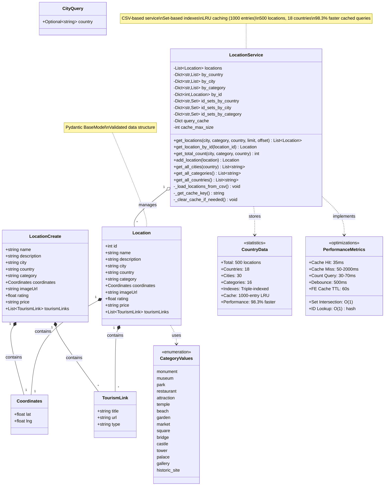

# Roamy - Data Models & Class Diagram

```mermaid
classDiagram
    class Location {
        +int id
        +string name
        +string description
        +string city
        +string country
        +string category
        +Coordinates coordinates
        +string imageUrl
        +float rating
        +string price
        +List~TourismLink~ tourismLinks
    }
    
    class Coordinates {
        +float lat
        +float lng
    }
    
    class TourismLink {
        +string title
        +string url
        +string type
    }
    
    class LocationCreate {
        +string name
        +string description
        +string city
        +string country
        +string category
        +Coordinates coordinates
        +string imageUrl
        +float rating
        +string price
        +List~TourismLink~ tourismLinks
    }
    
    class CityQuery {
        +Optional~string~ country
    }
    
    class LocationService {
        -List~Location~ locations
        -Dict~str,List~ by_country
        -Dict~str,List~ by_city
        -Dict~str,List~ by_category
        -Dict~int,Location~ by_id
        -Dict~str,Set~ id_sets_by_country
        -Dict~str,Set~ id_sets_by_city
        -Dict~str,Set~ id_sets_by_category
        -Dict query_cache
        -int cache_max_size
        +get_locations(city, category, country, limit, offset) List~Location~
        +get_location_by_id(location_id) Location
        +get_total_count(city, category, country) int
        +add_location(location) Location
        +get_all_cities(country) List~string~
        +get_all_categories() List~string~
        +get_all_countries() List~string~
        -_load_locations_from_csv() void
        -_get_cache_key() string
        -_clear_cache_if_needed() void
    }
    
    class CategoryValues {
        <<enumeration>>
        monument
        museum
        park
        restaurant
        attraction
        temple
        beach
        garden
        market
        square
        bridge
        castle
        tower
        palace
        gallery
        historic_site
    }
    
    class CountryData {
        <<statistics>>
        +Total: 500 locations
        +Countries: 18
        +Cities: 30
        +Categories: 16
        +Indexes: Triple-indexed
        +Cache: 1000-entry LRU
        +Performance: 98.3% faster
    }
    
    class PerformanceMetrics {
        <<optimizations>>
        +Set Intersection: O(1)
        +ID Lookup: O(1) hash
        +Cache Hit: 35ms
        +Cache Miss: 50-2000ms
        +Count Query: 30-70ms
        +Debounce: 500ms
        +FE Cache TTL: 60s
    }
    
    Location "1" *-- "1" Coordinates : contains
    Location "1" *-- "*" TourismLink : contains
    LocationCreate "1" *-- "1" Coordinates : contains
    LocationCreate "1" *-- "*" TourismLink : contains
    LocationService "1" o-- "*" Location : manages
    Location ..> CategoryValues : uses
    LocationService ..> CountryData : stores
    LocationService ..> PerformanceMetrics : implements
    
    note for Location "Pydantic BaseModel\nValidated data structure"
    note for LocationService "CSV-based service\nSet-based indexes\nLRU caching (1000 entries)\n500 locations, 18 countries\n98.3% faster cached queries"
```
