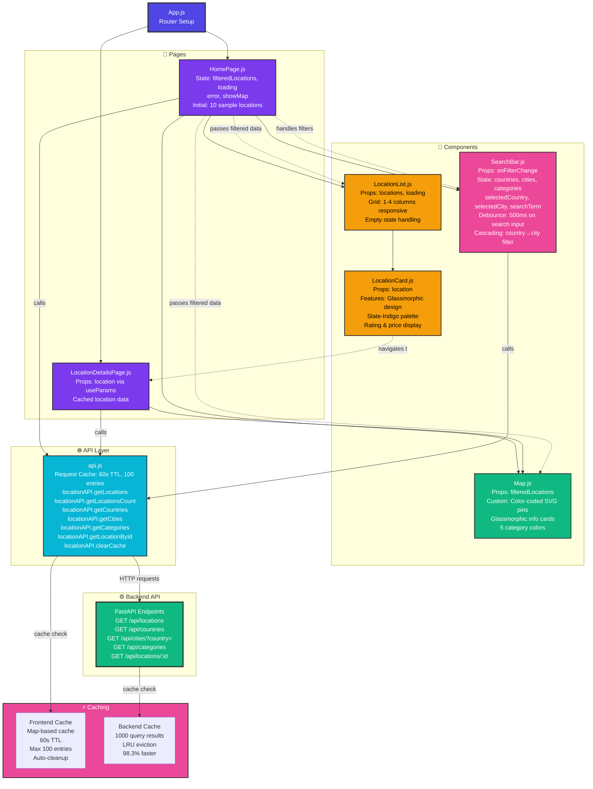

# BHRAMAN - React Component Hierarchy

```mermaid
graph TB
    APP[App.js<br/>Router Setup]
    
    subgraph PAGES["📄 Pages"]
        HOME[HomePage.js<br/>State: filteredLocations, loading<br/>error, showMap<br/>Initial: 10 sample locations]
        DETAILS[LocationDetailsPage.js<br/>Props: location via useParams<br/>Cached location data]
    end
    
    subgraph COMPONENTS["🧩 Components"]
        SEARCH[SearchBar.js<br/>Props: onFilterChange<br/>State: countries, cities, categories<br/>selectedCountry, selectedCity, searchTerm<br/>Debounce: 500ms on search input<br/>Cascading: country→city filter]
        
        MAP[Map.js<br/>Props: filteredLocations<br/>Custom: Color-coded SVG pins<br/>Glassmorphic info cards<br/>5 category colors]
        
        LIST[LocationList.js<br/>Props: locations, loading<br/>Grid: 1-4 columns responsive<br/>Empty state handling]
        
        CARD[LocationCard.js<br/>Props: location<br/>Features: Glassmorphic design<br/>Slate-Indigo palette<br/>Rating & price display]
    end
    
    subgraph API["🌐 API Layer"]
        API_SERVICE[api.js<br/>Request Cache: 60s TTL, 100 entries<br/>locationAPI.getLocations<br/>locationAPI.getLocationsCount<br/>locationAPI.getCountries<br/>locationAPI.getCities<br/>locationAPI.getCategories<br/>locationAPI.getLocationById<br/>locationAPI.clearCache]
    end
    
    subgraph CACHE["⚡ Caching"]
        FE_CACHE[Frontend Cache<br/>Map-based cache<br/>60s TTL<br/>Max 100 entries<br/>Auto-cleanup]
        BE_CACHE[Backend Cache<br/>1000 query results<br/>LRU eviction<br/>98.3% faster]
    end
    
    subgraph BACKEND["⚙️ Backend API"]
        FASTAPI[FastAPI Endpoints<br/>GET /api/locations<br/>GET /api/countries<br/>GET /api/cities?country=<br/>GET /api/categories<br/>GET /api/locations/:id]
    end
    
    APP --> HOME
    APP --> DETAILS
    
    HOME --> SEARCH
    HOME --> MAP
    HOME --> LIST
    
    LIST --> CARD
    DETAILS --> MAP
    
    SEARCH -->|calls| API_SERVICE
    HOME -->|calls| API_SERVICE
    DETAILS -->|calls| API_SERVICE
    
    API_SERVICE -->|cache check| FE_CACHE
    API_SERVICE -->|HTTP requests| FASTAPI
    FASTAPI -->|cache check| BE_CACHE
    
    HOME -.handles filters.-> SEARCH
    HOME -.passes filtered data.-> MAP
    HOME -.passes filtered data.-> LIST
    CARD -.navigates to.-> DETAILS
    
    style APP fill:#4f46e5,stroke:#333,stroke-width:3px,color:#fff
    style HOME fill:#7c3aed,stroke:#333,stroke-width:2px,color:#fff
    style DETAILS fill:#7c3aed,stroke:#333,stroke-width:2px,color:#fff
    style SEARCH fill:#ec4899,stroke:#333,stroke-width:2px,color:#fff
    style MAP fill:#10b981,stroke:#333,stroke-width:2px,color:#fff
    style LIST fill:#f59e0b,stroke:#333,stroke-width:2px,color:#000
    style CARD fill:#f59e0b,stroke:#333,stroke-width:2px,color:#000
    style API_SERVICE fill:#06b6d4,stroke:#333,stroke-width:2px,color:#fff
    style CACHE fill:#ec4899,stroke:#333,stroke-width:2px,color:#fff
    style FASTAPI fill:#10b981,stroke:#333,stroke-width:3px,color:#fff
```
